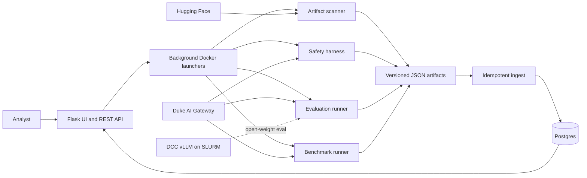

# AI Model Advisor

[](https://github.com/evelindsayyy/security-and-qa-for-ai-models/actions/workflows/ci.yml)
[](https://model-advisor.colab.duke.edu)
[](pyproject.toml)
[](unit_tests/)


An end-to-end model governance platform that turns Hugging Face artifacts and live LLM behavior into evidence-backed report cards. It combines supply-chain scanning, adversarial safety testing, LLM evaluation, and public benchmarks in one deployed Flask application backed by Postgres.

**[Explore the live Model Advisor](https://model-advisor.colab.duke.edu)**. The public catalog and report pages are open to browse. Starting or deleting a run requires Duke OIDC login because those actions consume shared infrastructure and model budget.

Built for the Duke Office of Information Technology through Code+ 2026.

## 1. Why It Exists

Choosing an institutional AI model is not a one-score problem. A model can be capable but unsafe, secure at inference but packaged with risky artifacts, or impressive on a public benchmark while failing the tasks an institution actually cares about.

AI Model Advisor keeps those questions separate and makes the evidence inspectable:

| Pillar | Decision question | Evidence |
|--------|-------------------|----------|
| Artifact scanning | Can the downloaded model compromise infrastructure? | ModelScan, Fickling, ModelAudit, dependency audits |
| Inference safety | Can the running model be misused or violate policy? | garak, promptfoo, Duke probes |
| Efficacy evaluation | How well does it perform on Duke-relevant tasks? | Rubric judging plus execution-based checks |
| Public benchmarks | How does it perform on standard capabilities? | MMLU, MBPP, TruthfulQA, IFEval, ToMi, consistency |

The UI keeps each pillar visible instead of compressing unlike risks into a misleading universal score.

---

## 2. Deployed Evidence

The production snapshot on August 11, 2026 contained:

| Signal | Production evidence |
|--------|---------------------|
| Catalog coverage | 56 models with at least one result |
| Artifact security | 14 scanned models |
| Adversarial safety | 28 safety runs |
| Institutional evaluation | 245 evaluation runs |
| Public benchmarks | 37 latest benchmark runs |
| Automated verification | 1,272 Python tests plus frontend Vitest coverage |

Every run produces a versioned JSON artifact. When a database DSN is available, the artifact is idempotently ingested into Postgres and becomes visible through the web UI and REST API. Disk artifacts remain the offline fallback when no database is configured.

---

## 3. System Architecture



The application VM runs the UI and isolated pillar containers. Long jobs return an ID immediately, continue in the background, and expose status to the browser. Public and private runs are separated both on disk and in Postgres, and server-side authorization protects every action that spends compute or deletes data.

The full run lifecycle, storage model, and host boundaries are documented in [`docs/architecture.md`](docs/architecture.md).

---

## 4. Evaluation That Measures Its Own Reliability

The efficacy pillar includes six rubric-scored suites and four execution-scored suites. SQL, JSON, numeric, and tool-use answers are run and checked directly, which gives the subjective judge scores a ground-truth anchor.

The evaluation contract SHA-pins 37 suites, rubrics, prompts, metrics, and schemas. A test fails if a frozen artifact changes in place, preventing an edited rubric from silently invalidating comparisons with earlier runs.

The automated judge was also tested against people:

| Validation signal | Result |
|-------------------|--------|
| Human study | 6 raters, 180 labels, 60 pairwise comparisons |
| Human agreement ceiling | Fleiss' kappa = 0.27 |
| Judge agreement with human consensus | Cohen's kappa = 0.23 |
| Detected position sensitivity | 45 percent order-flip rate |
| Mitigation | Judge every pair in both display orders and collapse flips to ties |

The result is intentionally bounded: the judge behaves like a reasonable additional rater on a subjective task, not an oracle. Full methods, limitations, and reproducible analysis are in [`docs/validation-study.md`](docs/validation-study.md).

---

## 5. Engineering Highlights

- Cross-pillar report cards combine scan, safety, evaluation, and benchmark evidence without hiding the underlying runs.
- A fail-closed pipeline gate prevents downstream evaluation when required security evidence is missing or high risk.
- Candidate and judge models must come from different model families, reducing self-judging bias.
- Gateway and self-hosted vLLM candidates share one evaluation contract and result schema.
- Public and per-user private runs use independent URLs, artifact paths, and database ownership fields.
- Browser launchers enforce allowlists and path validation before spawning Docker jobs.
- GitHub Actions runs Ruff, the Python suite, the frontend build, Vitest, and the production image build.
- Production uses a pinned Docker Compose project name, health checks, GHCR images, and an SSH deployment workflow.

---

## 6. My Contributions

This was a team project. My primary ownership was the efficacy pillar and the product surfaces that turn raw runs into decision-ready model evidence. Across my Git identities, I authored more than 200 commits in the migrated history.

I designed and implemented:

- The LLM-as-judge runner, rubric loading, execution-based SQL, JSON, numeric, and tool-use scoring, retry behavior, caching, and result schemas.
- Ten Duke task suites, the frozen evaluation contract, robustness testing, cost-versus-performance analysis, and cross-family judge selection.
- The six-rater validation study, including survey construction, Cohen and Fleiss agreement analysis, position-bias probes, Bradley-Terry ranking, and DPO-pair generation.
- Self-hosted Hugging Face evaluation through DCC, SLURM, and vLLM, using the same downstream evaluation contract as gateway models.
- Evaluation launch, comparison, detail, report-card, printable report, and pipeline-gating experiences in the Flask frontend.
- Resumable batch execution, Postgres loaders and queries, REST read APIs, and extensive unit and integration coverage for the efficacy workflow.

Raphael Karamagi and Nithi Vechalapu led artifact scanning and inference safety. Jack Yi contributed public benchmark work. Shared frontend, API, persistence, deployment, and integration code was developed collaboratively.

---

## 7. Quick Start

The default development path runs the web application and every pillar through Docker.

```bash
git clone git@github.com:evelindsayyy/security-and-qa-for-ai-models.git
cd security-and-qa-for-ai-models
uv sync --group dev
cp .env.example .env
./docker/build-pillars.sh
./docker/run.sh up -d --build
curl -s http://127.0.0.1:5000/api/health | python3 -m json.tool
```

Open `http://127.0.0.1:5000`. Gateway-backed runs require Duke credentials in `.env`. Artifact scanning may also require an `HF_TOKEN` for gated models.

The scanner, safety, and benchmark dependency groups intentionally conflict. Install at most one of those groups on the host, or use the pillar Docker images as shown above.

---

## 8. API Example

The REST API exposes list, detail, status, and start routes for each pillar.

```bash
curl -s http://127.0.0.1:5000/api/models | python3 -m json.tool
curl -s http://127.0.0.1:5000/api/evals | python3 -m json.tool
curl -s -X POST http://127.0.0.1:5000/api/scans \
  -H 'Content-Type: application/json' \
  -d '{"hf_repo":"distilbert-base-uncased"}' | python3 -m json.tool
```

Read [`api/README.md`](api/README.md) for the complete contract and authentication behavior.

---

## 9. Repository Map

| Path | Responsibility |
|------|----------------|
| [`scanner/`](scanner/README.md) | Hugging Face artifact and dependency security |
| [`safety/`](safety/README.md) | garak, promptfoo, and policy probes |
| [`evaluator/`](evaluator/README.md) | Duke suites, judges, execution checks, and DCC inference |
| [`benchmarks/`](benchmarks/README.md) | Standard public benchmark harnesses |
| [`frontend/`](frontend/README.md) | Flask application, report cards, comparisons, and launchers |
| [`api/`](api/README.md) | REST resources and ingest CLI |
| [`dbutils/`](dbutils/README.md) | Shared ingestion, visibility, and post-run synchronization |
| [`docs/`](docs/README.md) | Architecture, methodology, deployment, and data model |
| [`unit_tests/`](unit_tests/README.md) | Unit, route, contract, and integration tests |

---

## 10. Known Boundaries

- Duke task references are pipeline-validation material, not official institutional benchmarks.
- The human study is a calibration sample with six raters, so agreement estimates remain uncertain.
- Open-ended scores are directional. Execution-scored suites provide the stronger ground-truth signal.
- The current production deployment is a single application VM, not a horizontally scaled service.
- DCC open-weight inference currently depends on individual cluster access and should move to a service account.
- The repository is public for portfolio and educational review, but it does not currently grant an open-source license.

---

## 11. Documentation

| Topic | Guide |
|-------|-------|
| Architecture and run lifecycle | [`docs/architecture.md`](docs/architecture.md) |
| Evaluation handoff and caveats | [`docs/handoff-efficacy.md`](docs/handoff-efficacy.md) |
| Judge validation study | [`docs/validation-study.md`](docs/validation-study.md) |
| Data model and ingestion | [`docs/data-model.md`](docs/data-model.md) |
| Docker and production topology | [`docs/docker.md`](docs/docker.md) |
| All CLI commands | [`docs/cli.md`](docs/cli.md) |
| GitHub CI and deployment | [`.github/OPERATIONS.md`](.github/OPERATIONS.md) |

Project context: [Duke Code+](https://codeplus.duke.edu/project/security-quality-assurance-tools-dukes-ai-models/) and [Duke AI Suite](https://oit.duke.edu/ai-suite).
