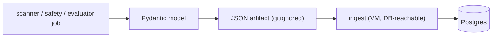
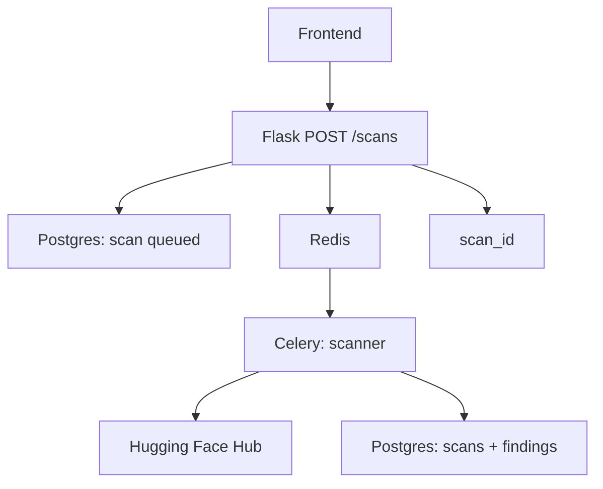
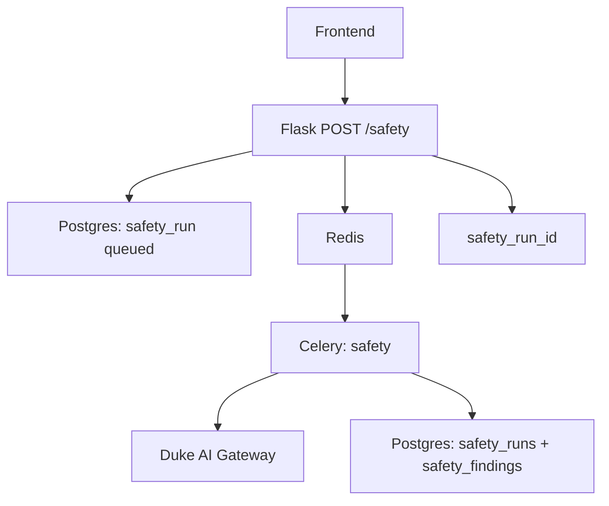
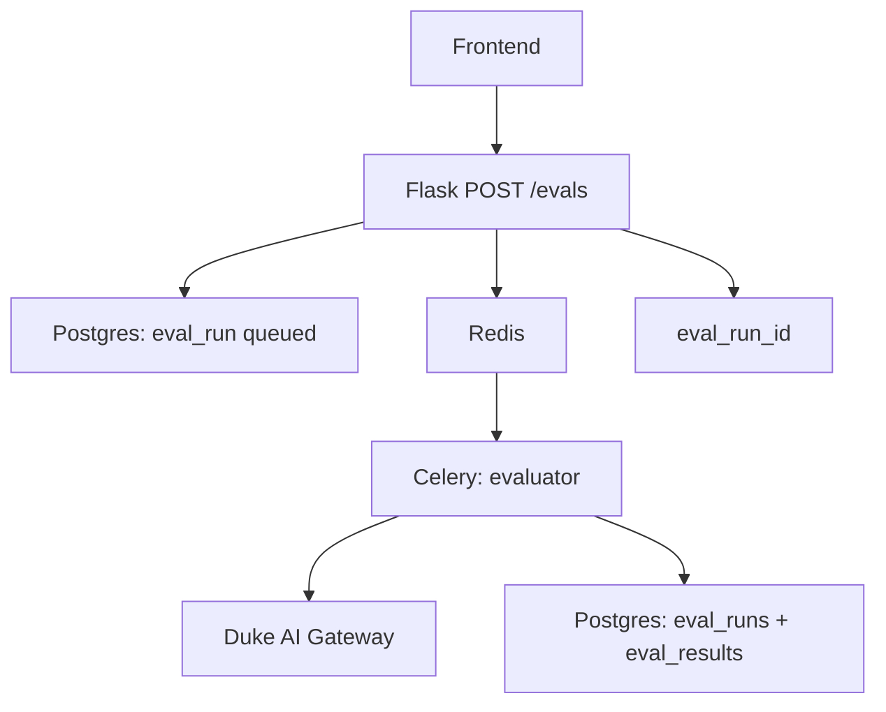
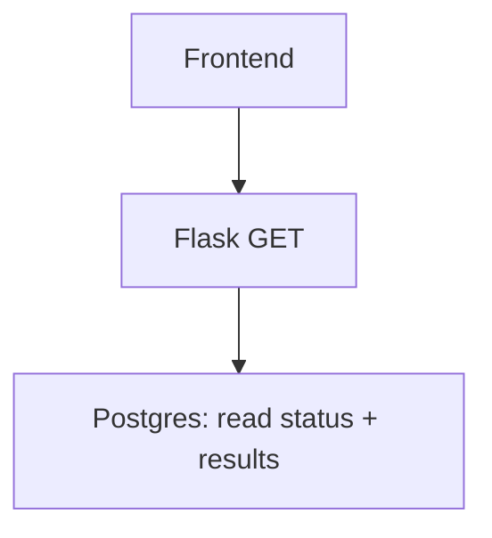

# Architecture

> Draft — **components, flows, deployment.** Tables and field examples: [`data-model.md`](data-model.md).

## Overview

Two nutrition-label pillars (**security**, **efficacy**) — two development tracks. See [`README.md`](README.md) and [`team-tracks.md`](team-tracks.md).

| Pillar | Part | Component | Track | Team |
|--------|------|-----------|-------|------|
| **Security** | Scanning | `scanner/` | A | Raphael, Nithi |
| **Security** | Safety | `safety/` | A | Raphael, Nithi |
| **Efficacy** | | `evaluator/` | B | Grace, Jack |

**Track A** delivers the **security** pillar: **scanning** (artifacts before deploy) and **safety** (inference harm, policy, red team). **Track B** delivers **efficacy** via Duke task suites and public benchmark subsets (see [`track-b-framework.md`](track-b-framework.md)), plus operational metrics (latency, tokens, cost, failure rate).

All tracks push structured results to a shared Postgres database. **`api/`** (Flask, week 5+) serves JSON; **`frontend/`** (Flask from week 3, full label UI by week 6) is the nutrition label UI per Grace's mockups.

## Compute and inference

Each job runs where it fits best; implementation specifics (host names, SLURM templates, DB reachability) live in [`context.md`](../context.md).

- **Application VM** (Duke OIT) — always-on orchestrator: `api/` (Flask), Celery workers, Redis, and the JSON→Postgres ingest. The only host with a database connection.
- **Docker sandbox** (DGX or any Docker host) — `scanner/` artifact jobs, isolated from untrusted files. CPU-bound, no GPU.
- **Inference** for safety and efficacy uses two interchangeable backends:
  - **Duke AI Gateway** (LiteLLM) — cloud / Azure / API-key models; the default path today, with gateway guardrails.
  - **DCC** (SLURM GPU cluster) — open-source Hugging Face weights served locally (e.g. vLLM); optional, selected by a flag. Bypasses the gateway by design (open weights only).

Both inference backends emit the **same** `SafetyResult` / `EvaluationResult` JSON, so scoring, ingest, and the frontend are identical regardless of backend.

## Results persistence: JSON → Postgres ingest

Every pillar defines Pydantic schemas — `scanner/schemas.py` (`ScanResult`, `Finding`), `safety/schemas.py` (`SafetyRunResult`, `MergedSafetyResult`, `SafetyFinding`), `evaluator/schemas.py` (`EvaluationResult`). Jobs serialize these to **JSON artifacts** first; a VM-side **ingest** step then loads them into Postgres.

JSON-then-ingest (rather than writing to the DB from each job) decouples compute from the database: compute hosts don't need a DB route, artifacts survive network restrictions, double as the frontend's offline data source, and give an audit trail. Ingest is idempotent (keyed on run id) and maps each document onto the tables in [`data-model.md`](data-model.md). Run outputs stay **gitignored**; commit only small curated fixtures (e.g. `unit_tests/fixtures/`) for tests and demos.

## System context

### Write paths (one per job type)

Each POST picks a Celery task, one external system, and one result family in Postgres. Redis is only the handoff from Flask to Celery.

**Scan** — user submits a Hugging Face model repo (`POST /scans`). Artifact inspection does not use the Duke gateway.

**Safety** — user starts red-team / policy probes on gateway models (`POST /safety`). Probes call live models via chat API.

**Eval** — user runs a task suite against one or more gateway models (`POST /evals`). Scoring uses gateway inference, not HF downloads.

| Job | POST | Celery package | External | Postgres tables |
|-----|------|----------------|----------|-----------------|
| Scan | `/scans` | `scanner/` | Hugging Face Hub (files) | `scans`, `findings` |
| Safety | `/safety` | `safety/` | Duke AI Gateway (chat) | `safety_runs`, `safety_findings` |
| Eval | `/evals` | `evaluator/` | Duke AI Gateway (chat) | `eval_runs`, `eval_results` |

Track A: scanning + safety. Track B: evaluator.

### Read path (GET)

Same for all three job types: the frontend calls a GET endpoint with the job id (or model id for history); Flask returns JSON from Postgres.

| When | GET endpoint | What the user sees |
|------|--------------|-------------------|
| Poll a scan | `GET /scans/{id}` | `status`, risk level, findings |
| Poll safety | `GET /safety/{id}` | probe pass/fail by category |
| Poll eval | `GET /evals/{id}` | per-task scores, comparison |
| Browse label | `GET /models`, `GET /models/{id}` | inventory + full scan/safety/eval history |

## Components

### Scanner — `scanner/` (scanning — Track A)

Pure-Python, artifact-level. Given a Hugging Face model ID, it pulls files via the HF Hub library and runs:

- **Format detector** — classifies files (safetensors, pickle/PyTorch, ONNX, config, code, other).
- **ModelAudit** — content-routed scan of candidate model files (defense-in-depth with ModelScan/Fickling).
- **Pickle inspector** — uses [fickling](https://github.com/trailofbits/fickling) to walk the serialization AST and flag dangerous operations (designed to catch attacks like nullifAI).
- **Dependency scanner** — `pip-audit` + direct OSV API queries against `requirements.txt` / `pyproject.toml` shipped alongside the model.
- **Secret scanner** — [TruffleHog](tool-stack.md) wrapper for credentials accidentally committed to model repos.
- **Risk scorer** — max tier across ModelScan, Fickling, and ModelAudit; dedupes correlated findings (`corroborated_by`).

Output: a `ScanResult` document persisted to Postgres. Details: [`track-a-framework.md`](track-a-framework.md). Tools: [`tool-stack.md`](tool-stack.md).

### Safety — `safety/` (safety — Track A)

Inference-level policy, harm, and red-team checks via LiteLLM (gateway or on-prem).

- **garak** — broad automated vulnerability probes.
- **promptfoo** — declarative YAML red-team suites and CI regression ([promptfoo](https://github.com/promptfoo/promptfoo)).
- **Duke probes** — institutional policy scenarios (may live in promptfoo configs).
- **Deployment context** — probe subsets by chatbot vs agentic, tools, guardrails.

Output: `SafetyResult` in Postgres. See [`track-a-framework.md`](track-a-framework.md), [`tool-stack.md`](tool-stack.md).

### Evaluator — `evaluator/` (efficacy — Track B)

Gateway task evaluation via LiteLLM. Loads Duke suites from `tasks/`; records scores and operational metrics (latency, tokens, cost). Suite list and rollout: [`track-b-framework.md`](track-b-framework.md). Week 5: `eval_runs` / `eval_results` in Postgres.

### API — `api/`

Flask application (factory pattern) wrapping security (scanning + safety) and efficacy. Long-running scans and evals are enqueued to Celery; routes return a job id without blocking.

| Endpoint | Purpose |
|---|---|
| `POST /scans` | submit a scan job (HF model ID in) → returns `scan_id` |
| `GET /scans/{id}` | status + structured results |
| `GET /models` | inventory with latest risk score per model |
| `GET /models/{id}` | full report — scan + eval + safety history |
| `POST /safety` | submit a safety probe run (model IDs + deployment context) |
| `GET /safety/{id}` | safety profile + per-category pass/fail |
| `POST /evals` | submit an efficacy eval run (list of model IDs + task suite) |
| `GET /evals/{id}` | results, including cross-model comparison |

### Async jobs and database

Long jobs: Flask → Redis → Celery → Postgres (see [System context](#system-context)). Schema: [`data-model.md`](data-model.md). Week 5: migrations and API persistence.

### Frontend — `frontend/`

Nutrition label UI. See [`frontend/README.md`](../frontend/README.md).

| Week | Focus |
|------|--------|
| 3 | Flask app; model list (`/models`); align with mockups |
| 4–5 | Model detail stubs; call `api/` when live |
| 6 | Full label — list, detail (scan / safety / efficacy), submit-scan form |

Stack may add Next.js/Tailwind in the same directory; Recharts for charts. Auth: Duke Shibboleth if available, else VM firewall for prototype.

## Job flows (scan, safety, eval)

End-to-end paths and GET pairing: [System context](#system-context). Summary:

| Job | Start (POST) | Poll / view (GET) |
|-----|--------------|-------------------|
| Scan | `POST /scans` → `scanner/` → Hugging Face Hub | `GET /scans/{id}` |
| Safety | `POST /safety` → `safety/` → Duke AI Gateway | `GET /safety/{id}` |
| Eval | `POST /evals` → `evaluator/` → Duke AI Gateway | `GET /evals/{id}` |

## Deployment

- **Application VM** (Duke OIT): hosts `api/`, Celery workers, Redis, frontend, and the Postgres client/ingest. It is the only tier with a route to the database.
- **GPU work is delegated:** artifact scanning runs in a Docker sandbox (DGX or VM); open-source model inference runs on DCC via SLURM. Neither needs the VM to carry a standing GPU.
- **Containerization:** Docker + Docker Compose. One command starts API + worker + Redis + Postgres + frontend.
- **Production compose:** no hot reload, proper restart policies, secrets from environment variables.
- **Database access:** Postgres (`codeplus-postgres-test-01.oit.duke.edu`) is reachable from the VM only; developers connect over the Duke VPN or an SSH tunnel. Rotate any credential that has been shared in plaintext.
- **CI/CD:** GitLab CI runs lint, unit tests, and a Docker build check on every push to `main`.

## Open Questions

- Async backend — Celery + Redis on the application VM orchestrates all jobs; GPU inference for open-source models is delegated to DCC via SLURM (`sbatch` over SSH), with results pulled back and ingested. Closed-source / gateway models need no GPU and run directly from the worker.
- Frontend stack — Flask in `frontend/` now; Next.js + Tailwind possible week 6 in the same directory.
- Auth — Duke Shibboleth preferred; prototype may run unauthenticated behind the VM firewall.
- LiteLLM guardrail hooks — document integration path (week 5); prototype may ship without hooks.
- Public benchmark pilot — IFEval vs DocBench-style subset (see track-b-framework).
