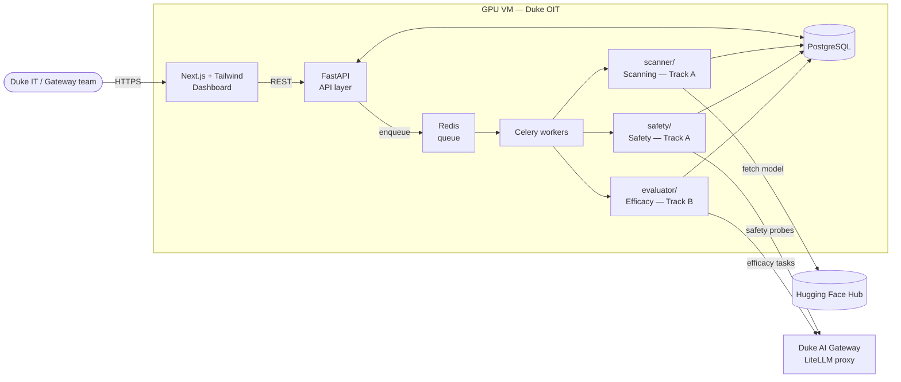
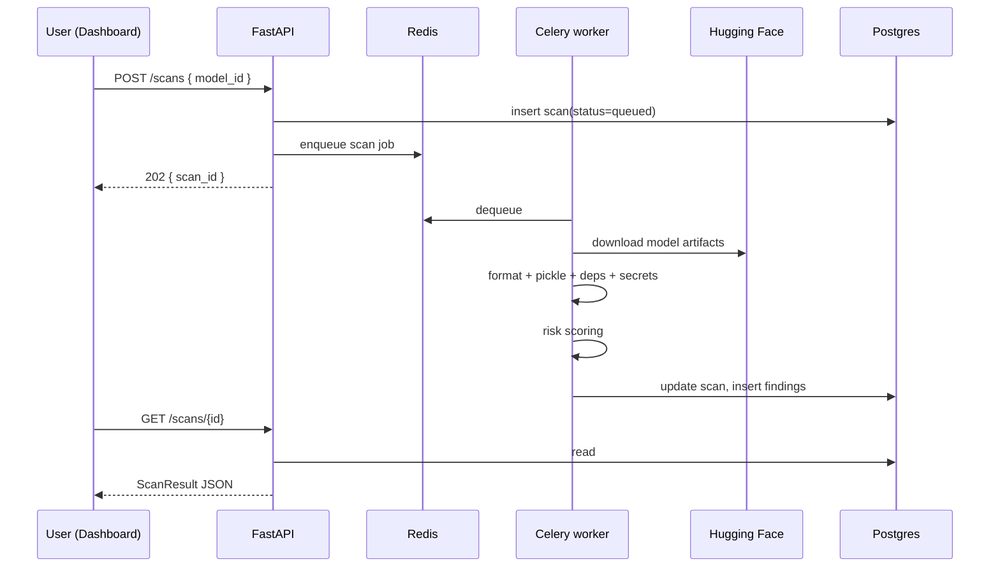
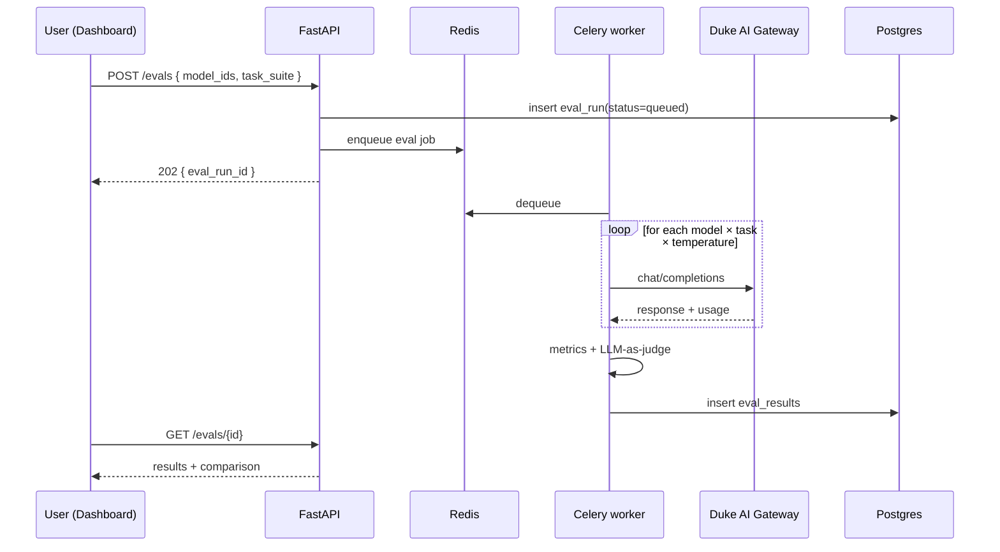

# Architecture

> Draft

## Overview

Two nutrition-label pillars (**security**, **efficacy**) — two development tracks. See [`README.md`](README.md) and [`team-tracks.md`](team-tracks.md).

| Pillar | Part | Component | Track | Team |
|--------|------|-----------|-------|------|
| **Security** | Scanning | `scanner/` | A | Raphael, Nithi |
| **Security** | Safety | `safety/` | A | Raphael, Nithi |
| **Efficacy** | | `evaluator/` | B | Grace, Jack |

**Track A** delivers the **security** pillar: **scanning** (artifacts before deploy) and **safety** (inference harm, policy, red team). **Track B** delivers **efficacy** via Duke task suites and public benchmark subsets (see [`evaluation-framework.md`](evaluation-framework.md)), plus operational metrics (latency, tokens, cost, failure rate).

All tracks push structured results to a shared Postgres database. A FastAPI service exposes results to a Next.js dashboard.

## System Context

## Components

### Scanner — `scanner/` (scanning — Track A)

Pure-Python, artifact-level. Given a Hugging Face model ID, it pulls files via the HF Hub library and runs:

- **Format detector** — classifies files (safetensors, pickle/PyTorch, ONNX, config JSON, code) and flags anything that needs deeper inspection.
- **Pickle inspector** — uses [fickling](https://github.com/trailofbits/fickling) to walk the serialization AST and flag dangerous operations (designed to catch attacks like nullifAI).
- **Dependency scanner** — `pip-audit` + direct OSV API queries against `requirements.txt` / `pyproject.toml` shipped alongside the model.
- **Secret scanner** — [TruffleHog](tool-stack.md) wrapper for credentials accidentally committed to model repos.
- **Risk scorer** — weighted rubric mapping findings to Low / Medium / High / Critical; reconciles ModelScan vs Fickling disagreements.

Output: a `ScanResult` document persisted to Postgres. Details: [`track-a-framework.md`](track-a-framework.md). Tools: [`tool-stack.md`](tool-stack.md).

### Safety — `safety/` (safety — Track A)

Inference-level policy, harm, and red-team checks via LiteLLM (gateway or on-prem).

- **garak** — broad automated vulnerability probes.
- **promptfoo** — declarative YAML red-team suites and CI regression ([promptfoo](https://github.com/promptfoo/promptfoo)).
- **Duke probes** — institutional policy scenarios (may live in promptfoo configs).
- **Deployment context** — probe subsets by chatbot vs agentic, tools, guardrails.

Output: `SafetyResult` in Postgres. See [`track-a-framework.md`](track-a-framework.md), [`tool-stack.md`](tool-stack.md).

### Evaluator — `evaluator/` (efficacy — Track B)

Pure-Python, inference-level **performance** evaluation. Calls Duke Gateway models through LiteLLM.

- **Runner** — multiple models × multiple tasks × temperature variations, with timeouts and error handling.
- **Task loader** — Duke YAML suites from `tasks/`; optional imported subsets from public benchmarks per [`evaluation-framework.md`](evaluation-framework.md).
- **Three-layer eval model** — (1) Duke-custom tasks primary; (2) adapted benchmark subsets where task type matches; (3) published external scores as reference on nutrition label only.
- **Efficacy metrics** — ROUGE-L for text overlap; LLM-as-judge for graded scoring (see `tasks/rubrics/`).
- **Variation testing** — N rephrased prompts per task, measure response consistency (Charley Kneifel).
- **Operational metrics** — latency, token usage, cost, failure rate per call (ITSO: availability is part of CIA).
- **Comparator** — structured side-by-side output across N models.

Output: `EvalRun` + `TaskResult` rows in Postgres (`provenance`: `duke` | `benchmark`).

Full benchmark mapping (SWE-bench, MT-Bench, MMLU, function-calling leaderboards, etc.): [`evaluation-framework.md`](evaluation-framework.md).

### API — `api/`

FastAPI service wrapping security (scanning + safety) and efficacy. Async-by-default: long-running scans and evals are enqueued, never block the request.

| Endpoint | Purpose |
|---|---|
| `POST /scans` | submit a scan job (HF model ID in) → returns `scan_id` |
| `GET /scans/{id}` | status + structured results |
| `GET /models` | inventory with latest risk score per model |
| `GET /models/{id}` | full report — scan + eval + safety history |
| `POST /safety` | submit a safety probe run (model IDs + deployment context) |
| `GET /safety/{id}` | safety profile + per-category pass/fail |
| `POST /evals` | submit an efficacy eval run (list of model IDs + task suite) |
| `GET /evals/{id}` | results, including cross-model comparison |

### Async jobs — Celery + Redis

Scans and evaluations are long-running. The API enqueues a job in Redis; Celery workers pick it up, run the scanner or evaluator, and write results back to Postgres. The API never blocks. For GPU-bound eval jobs, the worker may shell out to a SLURM-scheduled batch process when the VM provides cluster access — TBD with Duke OIT.

### Database — PostgreSQL

Single Postgres instance on the GPU VM. **`models`** rows represent gateway catalog entries (and optional HF repos for on-prem). Full sketch: [`data-model.md`](data-model.md).

Week 2: Team agrees `deployment_context` JSON and pillar field names. Week 5: migrations + API persistence for scans, safety runs, and eval runs.

### Frontend — `frontend/`

Next.js + Tailwind. Three pages for the prototype:

- **Model list** — inventory with security (scanning + safety) and efficacy status
- **Model detail** — scanning findings, safety heatmap, efficacy comparison charts
- **Submit new scan** — form taking a HF URL

Recharts for charts. Duke Shibboleth via VM config; if blocked, skip auth for the prototype and document it as future work.

## Scan request flow

## Eval request flow

## Deployment

- **Target:** GPU VM provisioned by Duke OIT.
- **Containerization:** Docker + Docker Compose. One command starts API + worker + Redis + Postgres + frontend.
- **Production compose:** no hot reload, proper restart policies, secrets from environment variables.
- **CI/CD:** GitLab CI runs lint, unit tests, and a Docker build check on every push to `main`.

## Open Questions

- Async backend — Celery + Redis is the default; SLURM only if Duke OIT exposes the cluster scheduler from the GPU VM.
- Frontend stack — Next.js + Tailwind is the working choice; Streamlit is a fallback if frontend ownership becomes a problem.
- Auth — Duke Shibboleth preferred; prototype may run unauthenticated behind the VM firewall.
- LiteLLM guardrail hooks — document integration path (week 5); prototype may ship without hooks.
- Public benchmark pilot — IFEval vs DocBench-style subset (see evaluation-framework).
