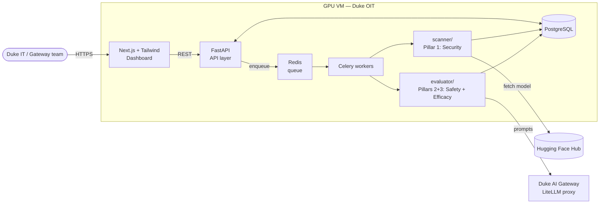
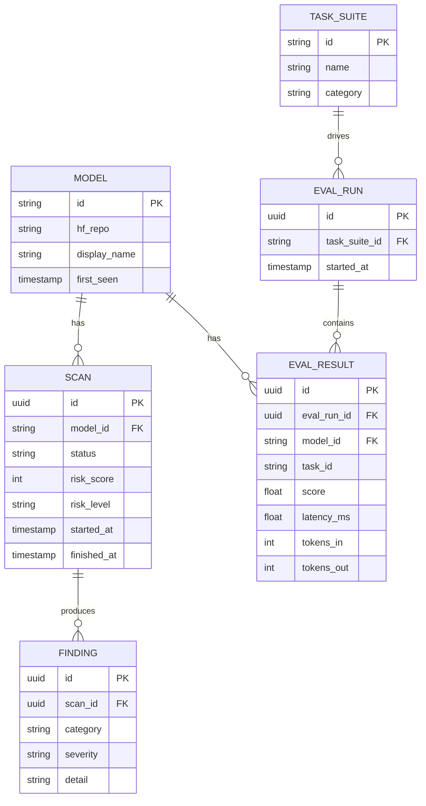
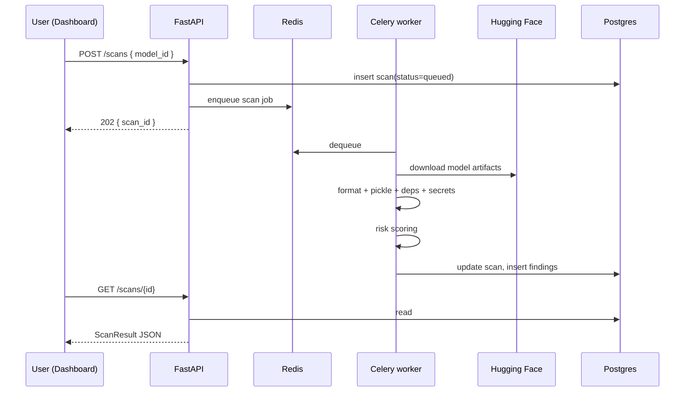
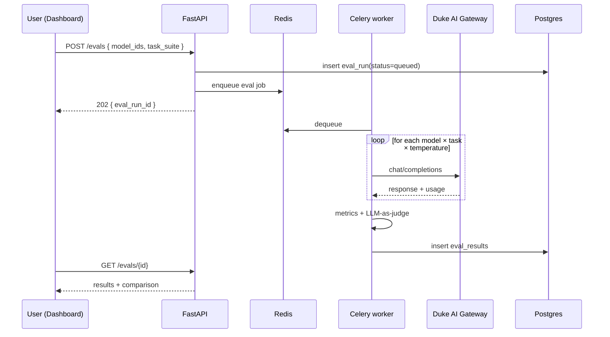

# Architecture

> Draft — subject to change as scope is confirmed with stakeholders and the GPU VM is provisioned.

## Overview

Three pillars, one dashboard. The **scanner** (security) inspects model files before they touch Duke infrastructure; the **evaluator** (safety + efficacy) probes models at inference time via the Duke AI Gateway. Both pillars push structured results to a shared Postgres database. A FastAPI service exposes results to a Next.js dashboard.

## System Context

## Components

### Scanner — `scanner/` (Pillar 1: Security)

Pure-Python, artifact-level. Given a Hugging Face model ID, it pulls files via the HF Hub library and runs:

- **Format detector** — classifies files (safetensors, pickle/PyTorch, ONNX, config JSON, code) and flags anything that needs deeper inspection.
- **Pickle inspector** — uses [fickling](https://github.com/trailofbits/fickling) to walk the serialization AST and flag dangerous operations (designed to catch attacks like nullifAI).
- **Dependency scanner** — `pip-audit` + direct OSV API queries against `requirements.txt` / `pyproject.toml` shipped alongside the model.
- **Secret scanner** — TruffleHog wrapper for credentials accidentally committed to model repos.
- **Risk scorer** — weighted rubric mapping findings to Low / Medium / High / Critical.

Output: a `ScanResult` document persisted to Postgres.

### Evaluator — `evaluator/` (Pillars 2 + 3: Safety & Efficacy)

Pure-Python, inference-level. Calls Duke Gateway models through the LiteLLM OpenAI-compatible API.

- **Runner** — multiple models × multiple tasks × temperature variations, with timeouts and error handling.
- **Task loader** — reads and validates YAML task suites from `tasks/`.
- **Safety probes** — 25–30 prompts across the Llama Guard hazard taxonomy (harmful content, academic dishonesty, sensitive data disclosure, jailbreak resistance).
- **Efficacy metrics** — ROUGE-L for text overlap; latency and token counts captured per call; LLM-as-judge for graded scoring on open-ended tasks.
- **Comparator** — structured side-by-side output across N models, feeds the recommendation engine.

Output: `EvalRun` + `EvalResult` rows in Postgres.

### API — `api/`

FastAPI service wrapping both pillars. Async-by-default: long-running scans and evals are enqueued, never block the request.

| Endpoint | Purpose |
|---|---|
| `POST /scans` | submit a scan job (HF model ID in) → returns `scan_id` |
| `GET /scans/{id}` | status + structured results |
| `GET /models` | inventory with latest risk score per model |
| `GET /models/{id}` | full report — scan + eval + safety history |
| `POST /evals` | submit an eval run (list of model IDs + task suite) |
| `GET /evals/{id}` | results, including cross-model comparison |

### Async jobs — Celery + Redis

Scans and evaluations are long-running. The API enqueues a job in Redis; Celery workers pick it up, run the scanner or evaluator, and write results back to Postgres. The API never blocks. For GPU-bound eval jobs, the worker may shell out to a SLURM-scheduled batch process when the VM provides cluster access — TBD with Duke OIT.

### Database — PostgreSQL

Single Postgres instance on the GPU VM. Schema designed in Week 2 before any data-access code is written. Sketch:

### Frontend — `frontend/`

Next.js + Tailwind. Three pages for the prototype:

- **Model list** — inventory with three-pillar status, risk scores, and filtering
- **Model detail** — scan findings breakdown, eval comparison charts, safety heatmap
- **Submit new scan** — form taking a HF URL

Recharts for charts. Duke Shibboleth via VM config; if blocked, skip auth for the prototype and document it as future work.

## Scan request flow

## Eval request flow

## Deployment

- **Target:** GPU VM provisioned by Duke OIT (pending).
- **Containerization:** Docker + Docker Compose. One command starts API + worker + Redis + Postgres + frontend.
- **Production compose:** no hot reload, proper restart policies, secrets from environment variables.
- **CI/CD:** GitLab CI runs lint, unit tests, and a Docker build check on every push to `main`.

## Open Questions

- Async backend — Celery + Redis is the default; SLURM only if Duke OIT exposes the cluster scheduler from the GPU VM.
- Frontend stack — Next.js + Tailwind is the working choice; Streamlit is a fallback if frontend ownership becomes a problem.
- Auth — Duke Shibboleth preferred; prototype may run unauthenticated behind the VM firewall.
- AI Gateway integration path — document with Michael Faber in parallel; not required for the prototype to ship.
