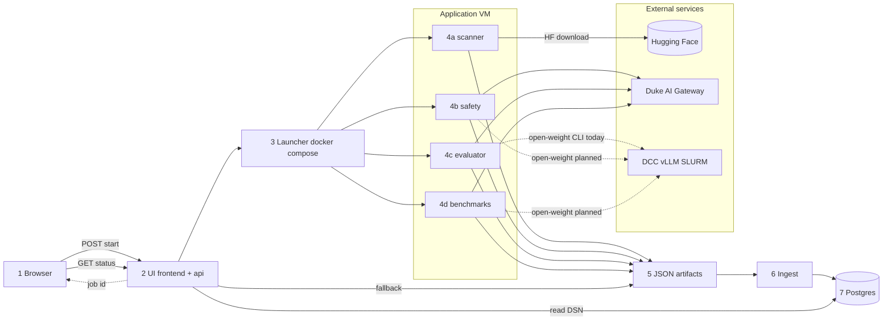

# Architecture

System components and how a run flows end to end. Schema and field examples: [`data-model.md`](data-model.md).

## Pillars

Two AI Model Advisor pillars, two tracks:

| Pillar | Components | Track |
|--------|------------|-------|
| **Security** | `scanner/` (artifacts) + `safety/` (inference red-team) | A |
| **Efficacy** | `evaluator/` (Duke judge suites) + `benchmarks/` (public benchmarks) | B |

Every run produces structured JSON; optional ingest loads it into Postgres. The
`frontend/` UI renders the report cards; `api/` exposes JSON REST for all four
pillars (list, detail, status, POST jobs) — see [`api/README.md`](../api/README.md).
The UI is **server-rendered Jinja** with **Vite-built Preact islands**
(findings tables, comparison heatmap, live run progress, compare charts) under
`frontend/assets/` → `frontend/static/dist/`.
Teams and schedule: [`team-tracks.md`](team-tracks.md).

## How a run flows

Jobs start from the AI Model Advisor UI or CLI. The UI returns immediately with a
job id; a background launcher (`frontend/*_launch.py`) runs the pillar in Docker on
the **application VM**. Results land as JSON under each pillar's output dir;
optional ingest upserts into Postgres. The UI reads via `frontend/*_data.py`
(Postgres when a DSN is set and reachable, else on-disk JSON).



**Reading the diagram:** follow the main spine **left to right** (steps 1–7).
Steps 1–3 are the browser request and job spawn. Step 4 is where work happens —
**all four pillars run in Docker on the application VM**. External services sit on
the right: Hugging Face for scans; Duke Gateway for chat (default); DCC (dashed)
for open-weight models on safety, eval, and benchmarks — eval CLI today, others
on the roadmap. Steps 5–7 persist and serve results.

| Step | What | Detail |
|------|------|--------|
| **1** | Analyst uses browser | Start a job or open a report-card page |
| **2** | `frontend/` + `api/` | `POST /scans/start`, `/safety/start`, `/eval-run/start`, `/benchmarks/start` (or `/api/…`) — returns immediately |
| **3** | `frontend/*_launch.py` | Non-blocking `subprocess` → `docker compose run` on the VM Docker socket |
| **4** | Pillar containers | `scanner/`, `safety/`, `evaluator/`, `benchmarks/` — see tables below |
| **5** | JSON on disk | Artifacts under each pillar's output dir (source of truth) |
| **6** | Ingest | Auto-sync when `POSTGRES_DSN` is set (`AUTO_INGEST=0` to disable); bulk: `python -m api.ingest --apply` |
| **7** | Postgres + UI read | UI polls status, then reads Postgres (preferred) or disk JSON |

| Pillar | Today (VM UI + Docker) | Open-weight on DCC |
|--------|------------------------|--------------------|
| **scanner/** | Hugging Face download + security tools in sandbox | N/A (artifact scan, not chat) |
| **safety/** | garak + promptfoo + policy probes via Duke Gateway | Planned — same endpoint override as eval |
| **evaluator/** | LLM-judge suites via Duke Gateway (UI) | CLI today: `--candidate-endpoint`, `--inference-backend dcc`; UI wiring future |
| **benchmarks/** | Public benchmark harness via Duke Gateway | Planned — `inference_backend` in schema |

| Host | Runs | Notes |
|------|------|-------|
| **Application VM** | Flask UI, all pillar Docker jobs, ingest | Production — one host, Docker socket |
| **Duke AI Gateway** | Cloud / API chat inference (LiteLLM) | Default for safety, eval, benchmark |
| **DCC** | vLLM on SLURM for open-weight models | Eval CLI today; safety + benchmarks planned |
| **DGX** | Optional manual CLI dev | Not in production flow |

The application VM runs the UI and every browser-started job via `docker compose run`
on the host Docker socket. Scans download Hugging Face artifacts into a Docker
sandbox on the VM (no GPU). Safety, eval, and benchmark call the Duke gateway
over HTTPS by default. **Docker layout:** [`docker.md`](docker.md).

JSON API routes under `/api` for all four pillars (list, detail, status, POST start). See [`api/README.md`](../api/README.md). Example:

```bash
curl -s localhost:5000/api/health | python3 -m json.tool
curl -s localhost:5000/api/scans | python3 -m json.tool
curl -s -X POST localhost:5000/api/scans \
  -H 'Content-Type: application/json' \
  -d '{"hf_repo":"distilbert-base-uncased"}' | python3 -m json.tool
```

Eval results: `GET /api/evals`, `GET /api/evals/<slug>`, `POST /api/evals`.

## Key concepts

### Application VM

The **application VM** is the always-on Linux server Duke OIT provides for this
project. It runs the UI (`frontend/`), `api/`, all four pillar jobs in Docker,
background launchers, and ingest. Chat inference goes to the Duke gateway by
default; open-weight models can target DCC (eval CLI today; safety and benchmarks
planned).

### Background jobs

Long scans and evals take minutes to hours. Start routes return immediately; the pillar runs in the background while the UI polls status.

**MVP concurrency limits (shared VM, no auth):**

| Concern | Behavior |
|---------|----------|
| Same job params twice | Deduped via in-memory `_INFLIGHT` in each `*_launch.py` |
| Different jobs at once | Allowed — separate subprocesses and output paths |
| Same scan slug or safety `(slug, profile)` | Blocked by `run.lock` under the output dir (UI + CLI); second start returns existing job or exit **2** |
| Benchmark re-click same combo | Deduped in-memory; lock file is `benchmarks/results/<stem>.run.lock` |
| Multiple Flask workers | **Not supported** — `_RUNNING` is per-process |
| Auth | **None** — anyone who can reach the URL can start jobs |

While a job runs, status routes return a log tail (`message` or `log` field) for progress pages.

| Piece | Role |
|-------|------|
| **`frontend/*_launch.py`** | `subprocess.Popen` + `threading`; spawns Docker or host CLI from UI start routes |
| **`dbutils/run_lock.py`** | File lock coordinating UI launchers and scan/safety CLI |
| **Ingest** | Per-pillar `*/db/` loaders + `dbutils/post_run.py` — auto-sync after each successful run when DSN set; bulk via `python -m api.ingest` |
| **Postgres** | Optional read path when DSN is set; disk JSON remains source of truth |
| **`api/`** | JSON reads under `/api`; ingest orchestrator in `api/ingest.py` (CLI, not a route) |

### Ingest

**Ingest** loads a finished JSON file into Postgres: read file → validate → upsert rows per [`data-model.md`](data-model.md). When `POSTGRES_DSN` (or `EFFICACY_DB_DSN`) is set, each pillar calls `dbutils.post_run.maybe_sync_artifact` after a successful run. Set `AUTO_INGEST=0` in `.env` to disable. Bulk backfill: `python -m api.ingest --apply` or `python -m api.ingest bootstrap --apply` (all pillars, summary line). First-time VM setup: `./scripts/apply-schemas.sh --bootstrap` — see [`cli.md`](cli.md).

### JSON → Postgres (summary)

Pillars define the contract in code (`scanner/schemas.py`, `safety/schemas.py`, `evaluator/schemas.py`, etc.) — same logical shapes as the Postgres tables. Flow: **job → JSON file → optional ingest → Postgres or disk read → UI**. Detail: [`data-model.md`](data-model.md).

**Persistence approach:** versioned **SQL schema files** plus **psycopg** loaders in each pillar's `db/` directory. Shared helpers in [`dbutils/`](../dbutils/README.md). Unified dry-run/apply: `python -m api.ingest`. Ingest is idempotent (`ON CONFLICT DO NOTHING`); the UI reads Postgres when a DSN is set, else disk.

## Inference: two backends

Safety, eval, and benchmarks reach a model over an OpenAI-compatible chat API.
The backend is recorded in `inference_backend` on each run; everything after the
chat call is identical.

| Backend | Models | Status |
|---------|--------|--------|
| **Duke AI Gateway** (LiteLLM) | Cloud / API-key gateway models | Default for all UI jobs |
| **DCC** (SLURM + vLLM) | Open-source HF weights | Eval CLI today (`--candidate-endpoint`, `--inference-backend dcc`, `--hf-repo` in [`evaluator/runner.py`](../evaluator/runner.py)); safety + benchmarks planned |

## Jobs and data paths

| Job | Track | UI routes | Inference (default) | DCC (open-weight) | Postgres tables |
|-----|-------|-----------|----------------------|-------------------|-----------------|
| Scan | A | `/scans` | Hugging Face (VM Docker sandbox) | — | `scans`, `findings` |
| Safety | A | `/safety` | Duke Gateway | Planned | `safety_runs`, `safety_findings` |
| Eval | B | `/eval-run` | Duke Gateway | CLI today; UI future | `eval_runs`, `eval_results` |
| Benchmark | B | `/benchmarks` | Duke Gateway | Planned | `benchmark_runs` |

All four pillars have optional Postgres ingest. When a DSN is set and reachable, the UI reads Postgres for every pillar (merged
with artifacts not yet loaded); otherwise it reads artifacts directly.

## Why JSON → Postgres

Each job writes a JSON artifact first; **ingest** loads it into Postgres (see [Key concepts](#key-concepts)). Artifacts provide an audit trail and offline fallback when the database is unreachable. Ingest is idempotent (keyed on run id). Large outputs stay gitignored; only small fixtures are committed.

## Components

- **`scanner/`** (A) — pulls HF files and runs artifact checks (format, pickle/fickling, ModelAudit, dependencies, secrets) into a risk score → `ScanResult`. See [`track-a-framework.md`](track-a-framework.md), [`tool-stack.md`](tool-stack.md).
- **`safety/`** (A) — garak + promptfoo + Duke policy probes over LiteLLM → `MergedSafetyResult`. Probe subsets follow deployment context (chatbot vs agentic).
- **`evaluator/`** (B) — Duke task suites scored by an LLM judge against YAML rubrics; records scores plus cost / latency / tokens → `eval_runs`. Postgres path: [`evaluator/db/`](../evaluator/db/README.md). See [`track-b-framework.md`](track-b-framework.md).
- **`benchmarks/`** (B) — public benchmarks (IFEval, TruthfulQA, MMLU, ToMi, consistency); ingest + UI read via [`benchmarks/db/`](../benchmarks/db/README.md) and `frontend/benchmark_db_data.py`.
- **`api/`** — Flask REST under `/api`; see [`api/README.md`](../api/README.md).
- **`auth/`** — Duke OIDC login, sessions, allowlist; see [`auth/README.md`](../auth/README.md).
- **`frontend/`** — nutrition-label UI (Jinja shells + Preact islands); `frontend/*_data.py` + launch helpers; cross-pillar rollup (`model_rollup.py`, `model_summary.py`, `recommendation_rules.py`); pillar List/Compare matrices, reference guides, and the cross-pillar `/pipeline` gating view (`frontend/pipeline.py`). See [`frontend/README.md`](../frontend/README.md).

## Deployment and hosts

| Host | Role |
|------|------|
| **Application VM** (`vcm@model-advisor.colab.duke.edu`) | Production: `./docker/run.sh up` → Flask UI + `api/`; all pillar jobs via host Docker socket; `.env` holds secrets |
| **DCC** | SLURM + vLLM for open-weight chat (eval CLI today; safety + benchmarks planned); see [`scripts/dcc/`](../scripts/dcc/README.md) |
| **Duke AI Gateway** | Default chat backend for safety, eval, benchmarks (HTTPS, no local GPU) |
| **OIT Postgres** | Shared team DB (`qa_ai_models`); external to the VM |
| **DGX** (e.g. gx10) | Optional dev workstation — not required for production |

**VM layout:** git clone + `.env` + `./docker/build-pillars.sh` + `./docker/run.sh up -d --build`. The web container bind-mounts the repo and Docker socket; pillar jobs write JSON on the VM disk. Postgres is external.

**CI (GitLab):** lint → unit tests → on `main`, Buildah builds `docker/Dockerfile` and pushes to the GitLab container registry. **`deploy`** job SSHs to the application VM (manual Play on `main`, or `DEPLOY_AUTO=true`). See [`.gitlab/README.md`](../.gitlab/README.md).

## Open questions

- Frontend stack — Flask now; possibly Next.js + Tailwind later.
- Auth — Duke Shibboleth preferred; until then the app may run behind the VM firewall.
- LiteLLM guardrail hooks — integration path TBD.
- Benchmark catalog — which pilots become standing suites.
