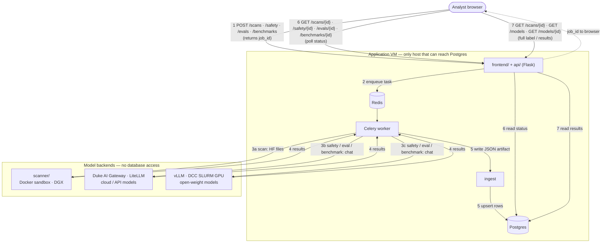

# Architecture

System components and how a run flows end to end. Schema and field examples: [`data-model.md`](data-model.md).

## Pillars

Two nutrition-label pillars, two tracks:

| Pillar | Components | Track |
|--------|------------|-------|
| **Security** | `scanner/` (artifacts) + `safety/` (inference red-team) | A |
| **Efficacy** | `evaluator/` (Duke judge suites) + `benchmarks/` (public benchmarks) | B |

Every run produces structured JSON that lands in Postgres. `api/` (Flask) serves it; `frontend/` (Flask) renders the label. Teams and schedule: [`team-tracks.md`](team-tracks.md).

## How a run flows

A run is asynchronous: the browser **POST**s to start a job (immediate `job_id`), a worker runs the pillar, results land in Postgres via ingest, then the browser **GET**s status and results. Only step 3 differs by job type.

**Today (prototype):** the frontend uses HTML routes (`POST /scans/start`, `GET /scans/<slug>/status`, …) and reads JSON from disk. **W5 target:** the same flow through `api/` REST paths below and Postgres.

| Step | HTTP | Path (`api/`) | What happens |
|------|------|------------------|--------------|
| 1 | **POST** | `/scans`, `/safety`, `/evals`, `/benchmarks` | Start job; enqueue Celery task; return `job_id` |
| 2 | — | (internal) | Worker pulls task from Redis |
| 3 | — | (internal) | Worker calls DGX, Gateway, or DCC |
| 4 | — | (internal) | Backend returns; worker builds JSON |
| 5 | — | (internal) | Ingest validates JSON → Postgres rows |
| 6 | **GET** | `/scans/{id}`, … | Poll until `status` is complete or failed |
| 7 | **GET** | `/scans/{id}`, `/models`, `/models/{id}` | Read structured results / full nutrition label |

Prototype equivalents: `POST /scans/start` → `GET /scans/<slug>/status` → `GET /scans/<slug>` (same pattern for `/safety`, `/eval-run`, `/benchmarks`).

| Host | Runs | Notes |
|------|------|-------|
| **Application VM** | Flask, Celery + Redis, ingest, Postgres | always on; **only** host that can reach Postgres |
| **DGX** | `scanner/` in a Docker sandbox | isolates untrusted model files; no DB access |
| **Duke AI Gateway** | cloud / API model inference (LiteLLM) | default chat backend |
| **DCC** | open-weight inference (vLLM on SLURM GPU) | optional; no DB access |

Three hosts because Postgres is firewalled to the VM, untrusted files need isolation, and open weights need a GPU. Developers reach Postgres over the Duke VPN or an SSH tunnel.

## Key concepts

### Application VM

The **application VM** is the always-on Linux server Duke OIT provides for this project. It runs the parts users share: `frontend/`, `api/`, background job workers, and the database client. **Only this VM has a network route to Postgres**. Long scan/safety/eval jobs are orchestrated from here; heavy or untrusted work is delegated outward and only JSON results come back.

### Celery and Redis

| Piece | Role |
|-------|------|
| **Redis** | A small in-memory **message queue** (broker). Holds a list of “jobs waiting to run.” |
| **Celery** | Python **background worker** framework. Workers pull jobs from Redis and run them outside the HTTP request. |

When a user clicks “Start scan,” the API must not block for 20 minutes. Flask enqueues a Celery task, returns a `job_id` immediately, and a worker runs the scanner later. 

### Ingest

**Ingest** is the step that **loads a finished JSON file into Postgres** on the application VM. Compute hosts write JSON but cannot reach the database; ingest runs where the DB connection exists. It reads the file → validates with Pydantic → inserts/updates SQL rows per [`data-model.md`](data-model.md).  

### JSON → Postgres (summary)

Pillars define the contract in code (`scanner/schemas.py`, `safety/schemas.py`, `evaluator/schemas.py`, etc.) — same logical shapes as the Postgres tables. Flow: **job → Pydantic/dataclass → JSON file → ingest (psycopg) → Postgres → GET API → UI**. Detail: [`data-model.md`](data-model.md).

**Persistence approach:** versioned **SQL schema files** plus **psycopg** loaders — established in [`evaluator/db/`](../evaluator/db/README.md) (standalone today). Shared plumbing for **new** pillar loaders lives in [`dbutils/`](../dbutils/README.md) (env, file IO, connect, JSONB params, dry-run CLI, schema apply). Ingest modules expose testable pure transforms and apply with `--apply`; reads use parameterized SQL. [`data-model.md`](data-model.md) is the column reference; disk JSON remains the pipeline source of truth until ingest runs.

## Inference: two backends

Safety and efficacy reach a model over an OpenAI-compatible chat API. The backend is a flag; everything after the chat call is identical.

| Backend | Models | Default? |
|---------|--------|----------|
| **Duke AI Gateway** (LiteLLM) | cloud / API-key | yes — gateway guardrails apply |
| **DCC** (SLURM + vLLM) | open-source weights | optional — bypasses the gateway by design |

## Jobs and endpoints

`POST` starts a job and returns a `job_id`; `GET` polls it.

| Job | Track | Endpoint | Backend (step 3) | Postgres |
|-----|-------|----------|-------------------|----------|
| Scan | A | `/scans` | Hugging Face files | `scans`, `findings` |
| Safety | A | `/safety` | gateway / DCC | `safety_runs`, `safety_findings` |
| Eval | B | `/evals` | gateway / DCC | `eval_runs`, `eval_results` |
| Benchmark | B | `/benchmarks` | gateway / DCC | `benchmark_runs` |

`GET /models` and `GET /models/{id}` return the inventory and a model's full label across all pillars.

## Why JSON → Postgres

Compute hosts can't reach the database, so each job writes a JSON artifact first; **ingest** on the VM loads it into Postgres (see [Key concepts](#key-concepts)). Artifacts also serve as the frontend's offline data source today and provide an audit trail. Ingest is idempotent (keyed on run id). Outputs are gitignored; only small fixtures are committed.

## Components

- **`scanner/`** (A) — pulls HF files and runs artifact checks (format, pickle/fickling, ModelAudit, dependencies, secrets) into a risk score → `ScanResult`. See [`track-a-framework.md`](track-a-framework.md), [`tool-stack.md`](tool-stack.md).
- **`safety/`** (A) — garak + promptfoo + Duke policy probes over LiteLLM → `MergedSafetyResult`. Probe subsets follow deployment context (chatbot vs agentic).
- **`evaluator/`** (B) — Duke task suites scored by an LLM judge against YAML rubrics; records scores plus cost / latency / tokens → `eval_runs`. Postgres path: [`evaluator/db/`](../evaluator/db/README.md). See [`track-b-framework.md`](track-b-framework.md).
- **`benchmarks/`** (B) — public benchmarks (IFEval, TruthfulQA, MMLU, ToMi, consistency); each has its own scoring but a shared run envelope → `benchmark_runs`.
- **`api/`** (planned) — Flask + Celery + Redis; enqueues jobs, serves results.
- **`frontend/`** — nutrition-label UI; reads JSON today, `api/` once persistence lands. Launch buttons run the real pillars via Docker. See [`frontend/README.md`](../frontend/README.md).

## Open questions

- Frontend stack — Flask now; possibly Next.js + Tailwind later.
- Auth — Duke Shibboleth preferred; the prototype may run behind the VM firewall.
- LiteLLM guardrail hooks — integration path TBD.
- Benchmark catalog — which pilots become standing suites.
