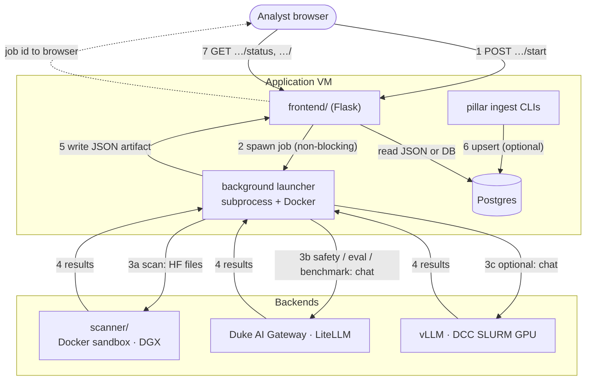

# Architecture

System components and how a run flows end to end. Schema and field examples: [`data-model.md`](data-model.md).

## Pillars

Two nutrition-label pillars, two tracks:

| Pillar | Components | Track |
|--------|------------|-------|
| **Security** | `scanner/` (artifacts) + `safety/` (inference red-team) | A |
| **Efficacy** | `evaluator/` (Duke judge suites) + `benchmarks/` (public benchmarks) | B |

Every run produces structured JSON; optional ingest loads it into Postgres. The
`frontend/` UI renders the nutrition label; `api/` exposes eval results as JSON
(see [`api/README.md`](../api/README.md)). Teams and schedule: [`team-tracks.md`](team-tracks.md).

## How a run flows

Jobs start from the nutrition-label UI or CLI. The UI returns immediately and
polls status while a background launcher (`frontend/*_launch.py`) runs the pillar
in Docker or on the host. Results land as JSON under each pillar's output dir;
optional ingest upserts into Postgres. The UI reads via `frontend/*_data.py`
(on-disk JSON, or Postgres when a DSN is set).

| Step | Route | What happens |
|------|-------|--------------|
| 1 | `POST /scans/start`, `/safety/start`, `/eval-run/start`, `/benchmarks/start` | Spawn background launcher |
| 2 | — | `subprocess` / `docker compose run` via `frontend/*_launch.py` |
| 3 | — | Pillar calls DGX, gateway, or DCC |
| 4 | — | Backend returns; launcher writes JSON under `*/output/` or `*/results/` |
| 5 | — | Optional: `scanner/db/load_scans.py`, `safety/db/load_safety.py`, `evaluator/db/load_results.py` |
| 6 | `GET …/<slug>/status`, `GET …/<slug>` | Poll job; read results (disk or Postgres) |

Eval results are also available as JSON at `GET /api/evals` and `GET /api/evals/<slug>`.

| Host | Runs | Notes |
|------|------|-------|
| **Application VM** | Flask app ([`docker/`](../docker/)), background launchers, ingest | Shared UI and job orchestration |
| **DGX** | `scanner/` in a Docker sandbox | Isolates untrusted model files |
| **Duke AI Gateway** | cloud / API inference (LiteLLM) | Default chat backend |
| **DCC** | open-weight inference (vLLM on SLURM) | Optional GPU backend |

Multiple hosts: untrusted scans stay sandboxed on DGX; the gateway and DCC serve inference; the application VM runs the shared UI and launchers. **Docker layout:** [`docker.md`](docker.md).

## Key concepts

### Application VM

The **application VM** is the always-on Linux server Duke OIT provides for this project. It runs the shared UI (`frontend/`), `api/`, background job launchers, and ingest. Long jobs are orchestrated from here; heavy or untrusted work is delegated to DGX, the gateway, or DCC.

### Background jobs

Long scans and evals take minutes to hours. Start routes return immediately; the pillar runs in the background while the UI polls status.

| Piece | Role |
|-------|------|
| **`frontend/*_launch.py`** | `subprocess.Popen` + `threading`; spawns Docker or host CLI from UI start routes |
| **Pillar ingest CLIs** | `scanner/db/`, `safety/db/`, `evaluator/db/` — JSON → Postgres (`--apply`) |
| **Postgres** | Optional read path when DSN is set; disk JSON remains source of truth |
| **`api/`** | JSON read layer — see [`api/README.md`](../api/README.md) |

### Ingest

**Ingest** loads a finished JSON file into Postgres: read file → validate with Pydantic → upsert rows per [`data-model.md`](data-model.md). Jobs write JSON first by design (audit trail, idempotent reload, decoupled from DB outages).

### JSON → Postgres (summary)

Pillars define the contract in code (`scanner/schemas.py`, `safety/schemas.py`, `evaluator/schemas.py`, etc.) — same logical shapes as the Postgres tables. Flow: **job → JSON file → optional ingest → Postgres or disk read → UI**. Detail: [`data-model.md`](data-model.md).

**Persistence approach:** versioned **SQL schema files** plus **psycopg** loaders — established in [`evaluator/db/`](../evaluator/db/README.md) (eval, standalone) and [`scanner/db/`](../scanner/db/README.md) (scan, on **`dbutils`**). Shared plumbing for new pillar loaders lives in [`dbutils/`](../dbutils/README.md). Ingest modules expose testable pure transforms and apply with `--apply`; reads use parameterized SQL with disk fallback in the frontend.

## Inference: two backends

Safety and efficacy reach a model over an OpenAI-compatible chat API. The backend is a flag; everything after the chat call is identical.

| Backend | Models | Default? |
|---------|--------|----------|
| **Duke AI Gateway** (LiteLLM) | cloud / API-key | yes — gateway guardrails apply |
| **DCC** (SLURM + vLLM) | open-source weights | optional — `--candidate-endpoint` on evaluator CLI |

## Jobs and data paths

| Job | Track | UI routes | Backend | Postgres tables |
|-----|-------|-----------|---------|-----------------|
| Scan | A | `/scans` | Hugging Face files (DGX) | `scans`, `findings` |
| Safety | A | `/safety` | gateway | `safety_runs`, `safety_findings` |
| Eval | B | `/eval-run` | gateway / DCC | `eval_runs`, `eval_results` |
| Benchmark | B | `/benchmarks` | gateway | disk JSON (`benchmarks/results/`) |

Benchmark results are read from disk in the UI. Scan, safety, and eval support optional Postgres ingest.

## Why JSON → Postgres

Each job writes a JSON artifact first; **ingest** loads it into Postgres (see [Key concepts](#key-concepts)). Artifacts provide an audit trail and offline fallback when the database is unreachable. Ingest is idempotent (keyed on run id). Large outputs stay gitignored; only small fixtures are committed.

## Components

- **`scanner/`** (A) — pulls HF files and runs artifact checks (format, pickle/fickling, ModelAudit, dependencies, secrets) into a risk score → `ScanResult`. See [`track-a-framework.md`](track-a-framework.md), [`tool-stack.md`](tool-stack.md).
- **`safety/`** (A) — garak + promptfoo + Duke policy probes over LiteLLM → `MergedSafetyResult`. Probe subsets follow deployment context (chatbot vs agentic).
- **`evaluator/`** (B) — Duke task suites scored by an LLM judge against YAML rubrics; records scores plus cost / latency / tokens → `eval_runs`. Postgres path: [`evaluator/db/`](../evaluator/db/README.md). See [`track-b-framework.md`](track-b-framework.md).
- **`benchmarks/`** (B) — public benchmarks (IFEval, TruthfulQA, MMLU, ToMi, consistency); results in `benchmarks/results/`.
- **`api/`** — Flask REST under `/api`; see [`api/README.md`](../api/README.md).
- **`frontend/`** — nutrition-label UI; `frontend/*_data.py` + launch helpers. See [`frontend/README.md`](../frontend/README.md).

## Open questions

- Frontend stack — Flask now; possibly Next.js + Tailwind later.
- Auth — Duke Shibboleth preferred; until then the app may run behind the VM firewall.
- LiteLLM guardrail hooks — integration path TBD.
- Benchmark catalog — which pilots become standing suites.
