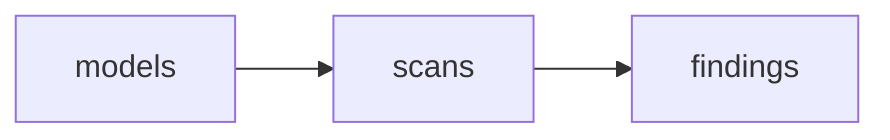
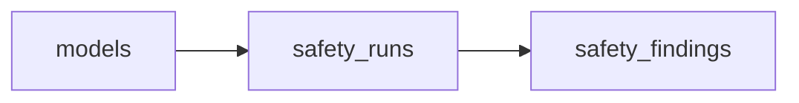
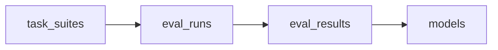

# Data model (Postgres sketch)

**Scope:** tables, columns, JSON field shapes. **Not here:** component diagrams or API flows — see [`architecture.md`](architecture.md).

Shared reference for **Team** schema work and Track A/B structured outputs. Implementation: week 5 API; design starts week 2.

Related: [`gateway-models.md`](gateway-models.md).

---

## Design principles

- One **`models`** row per gateway model (optional `hf_repo` when on-prem).
- Scanning → `scans` / `findings`. Safety → `safety_runs` / `safety_findings`. Efficacy → `eval_runs` / `eval_results`.
- Raw tool output in JSONB where needed; frontend uses normalized columns.

---

## Table chains

Anchor: **`models`**. Three chains (left to right). Filled by Celery after the matching **POST**; the frontend reads them via **GET** (see [`architecture.md`](architecture.md#post-vs-get-flask)).

**Scanning** (`POST /scans` → `scanner/` → Hugging Face): `models` → `scans` → `findings`



**Safety** (`POST /safety` → `safety/` → Duke AI Gateway): `models` → `safety_runs` → `safety_findings`



**Efficacy** (`POST /evals` → `evaluator/` → Duke AI Gateway): `task_suites` → `eval_runs` → `eval_results` → `models`



### Table reference (PostgreSQL)

| Table | Primary key | Foreign keys | Main columns |
|-------|-------------|--------------|--------------|
| `models` | `id` | — | `gateway_model_id`, `hf_repo` (optional), `display_name`, `provider`, `deployment_type`, `deployment_context` (JSONB) |
| `scans` | `id` (uuid) | `model_id` → `models` | `status`, `risk_score`, `risk_level`, `scan_result_json`, `finished_at` |
| `findings` | `id` (uuid) | `scan_id` → `scans` | `source`, `category`, `severity`, `detail` |
| `safety_runs` | `id` (uuid) | `model_id` → `models` | `status`, `deployment_context`, `tool_results`, `finished_at` |
| `safety_findings` | `id` (uuid) | `safety_run_id` → `safety_runs` | `category`, `probe_source`, `passed`, `detail` |
| `task_suites` | `id` | — | suite metadata (name, version) |
| `eval_runs` | `id` (uuid) | `task_suite_id` → `task_suites` | `status`, `finished_at` |
| `eval_results` | `id` (uuid) | `eval_run_id`, `model_id` | `task_id`, `score`, `latency_ms`, `tokens_in`, `tokens_out`, `cost_usd` (optional) |

---

## Spike → DB mapping

| Track | Types / files | Tables |
|-------|---------------|--------|
| A scanning | `ScanResult` — `testing/scanning/schemas.py` | `scans`, `findings` |
| A safety | `SafetyResult` (W2+) | `safety_runs`, `safety_findings` |
| B efficacy | TruthfulQA CSV (W2) → `EvalRun` (W3) | `eval_runs`, `eval_results` |

### TruthfulQA spike → `eval_results` (W2)

Detail CSV columns map to future `eval_results` rows:

| CSV column | DB field (target) |
|------------|-------------------|
| `provider_name` | logical provider alias |
| `model` | `gateway_model_id` |
| `row_index` | `task_id` or external id |
| `correct` | `score` (0/1) |
| `gold_letter`, `pred_letter` | store in `detail` JSONB |

Summary CSV: `provider_name`, `model`, `n`, `accuracy` → aggregate on `eval_runs`.

Committed sample: `testing/eval/output/samples/truthfulqa_w2_summary.csv`.

---

## `deployment_context` (JSON)

Agreed in week 2 Team issue. Suggested fields:

```json
{
  "surface": "chatbot | agentic",
  "guardrails_enabled": true,
  "tools_connected": false,
  "commercial_vs_oss": "commercial | oss",
  "notes": ""
}
```

Safety probe subsets and efficacy task subsets may differ for the same model — document in issue comments, not a single shared probe list.

---

## Nutrition label API (week 5)

`GET /models/{id}` returns summary:

```json
{
  "model_id": "...",
  "security": {
    "scanning": { "risk_level": "low", "last_scan_at": "..." },
    "safety": { "categories": [{ "name": "jailbreak", "passed": false }] }
  },
  "efficacy": { "suites": [{ "name": "it_support", "score": 0.82 }] }
}
```

Track A owns `security.*`; Track B owns `efficacy`; Team owns aggregation endpoint.
